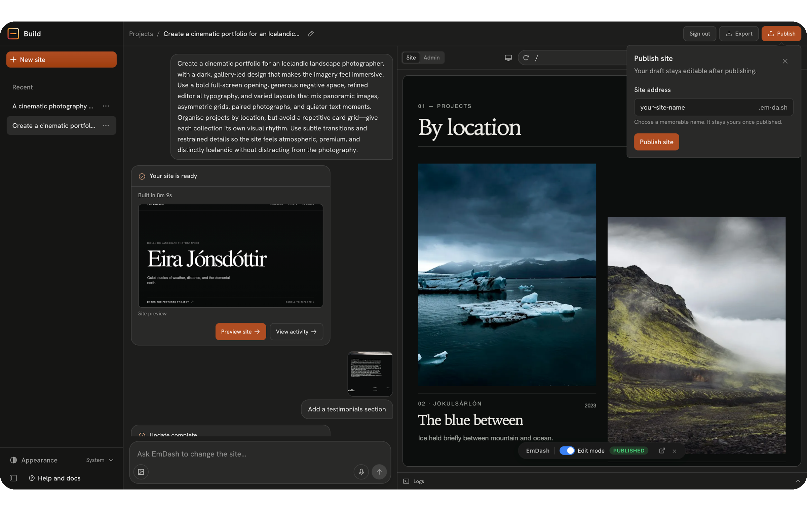
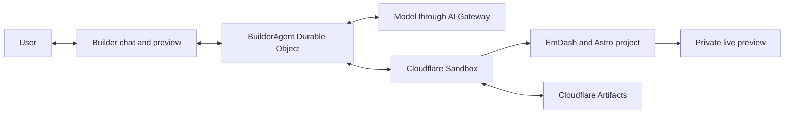

<p align="center">
  
</p>

<h1 align="center">EmDash Build</h1>

<p align="center">
  <strong>An open source AI site builder for editable EmDash sites, built on Cloudflare.</strong>
</p>

<p align="center">
  <a href="https://build.emdashcms.com">Try the demo</a> ·
  <a href="./docs/SELF-HOSTING.md">Self-host EmDash Build</a> ·
  <a href="./PLATFORM-ARCHITECTURE.md">Architecture</a> ·
  <a href="https://docs.emdashcms.com">EmDash documentation</a>
</p>

> [!IMPORTANT]
> EmDash Build is an alpha reference application for hosting providers, website builders, and platforms. The hosted demo has site publishing disabled.

## Editable sites from a brief

EmDash Build turns a site brief into an editable EmDash website. The agent designs a content model, fills it through EmDash's Model Context Protocol (MCP) server, and writes the Astro pages and components that render it. The result includes server-rendered pages, structured content, media storage, and the EmDash admin interface.

The generated site remains useful after the first build. Editors can update content in EmDash, add and reorder page sections, schedule posts, and return to the agent for larger content or design changes.



## Capabilities

- **Structured clarification**: Ask focused questions when a brief leaves important decisions open.
- **Agent-designed content models**: Create collections for reusable entities and structured blocks for editor-reorderable page sections.
- **Editable Astro sites**: Generate typed Astro components while keeping ordinary content in EmDash.
- **Live preview and repair**: Render the site in a private Builder preview, validate the generated project, inspect the result, and repair failures in the same agent loop.
- **EmDash content workflows**: Edit text and media, add or duplicate sections, reorder blocks, and manage content from the admin interface.
- **Durable project history**: Save source and local CMS state as Git commits in Cloudflare Artifacts and restore a project after its Sandbox sleeps.
- **Provider-controlled publishing**: Package validated, static site releases for Workers for Platforms when the operator explicitly enables and configures publishing.

## Project architecture

Each project receives a Cloudflare Sandbox with a prepared EmDash, Astro, and Tailwind project. A `BuilderAgent` Durable Object owns the conversation and model-and-tool loop. The agent creates the schema and content through EmDash MCP tools, writes the public frontend in the Sandbox, and validates the rendered site before completing a turn.

Cloudflare Artifacts stores the project as Git history. If the Sandbox sleeps, EmDash Build restores the source and local CMS state into a new container and restarts the preview.



## Agent workflow

1. **Understand**: Read the brief and ask structured questions when a material decision is missing.
2. **Model**: Decide which content belongs in collections and which narrative pages need structured blocks.
3. **Build**: Create the EmDash schema, refresh generated types, and write typed Astro renderers.
4. **Populate**: Add representative content and media through EmDash MCP tools.
5. **Verify**: Type-check the project, render public routes, inspect the preview, and repair failures.
6. **Save**: Commit the coherent project state to Cloudflare Artifacts.

## Run locally

### Prerequisites

- Node.js 24 or later
- pnpm 11.9
- A Docker-compatible daemon
- Wrangler authenticated to a Cloudflare account
- Cloudflare Workers, Durable Objects, Sandbox, Workers AI, AI Gateway, Artifacts, and Workers for Platforms access

Install the dependencies first:

```sh
pnpm install --frozen-lockfile
```

Copy `provider.config.example.json` to the ignored `provider.config.json`, replace every example value, and create the Cloudflare resources described in the [self-hosting guide](./docs/SELF-HOSTING.md). Then validate and render the provider configuration:

```sh
pnpm preflight
pnpm configure
```

Copy the local secrets template and add the AI Gateway credentials used by the builder. `UNSPLASH_ACCESS_KEY` is optional but enables stock-image search during generation:

```sh
cp .dev.vars.example .dev.vars
```

Start EmDash Build with the generated provider configuration:

```sh
EMDASH_WRANGLER_CONFIG=wrangler.provider.jsonc pnpm dev
```

Open `http://localhost:5173`. The UI-only development mode does not start Sandbox-backed generation:

```sh
pnpm dev:ui
```

## Development commands

| Command               | Purpose                                                   |
| --------------------- | --------------------------------------------------------- |
| `pnpm dev`            | Start EmDash Build with the default configuration         |
| `pnpm dev:ui`         | Start the interface without Cloudflare Sandbox containers |
| `pnpm check`          | Type-check the application and Worker tests               |
| `pnpm test`           | Run the application test suite                            |
| `pnpm test:worker`    | Run the Workers integration suite                         |
| `pnpm build`          | Build EmDash Build with the default configuration         |
| `pnpm build:provider` | Build with `wrangler.provider.jsonc`                      |
| `pnpm format`         | Format the repository with oxfmt                          |

## Self-hosting and security

Read the [self-hosting guide](./docs/SELF-HOSTING.md) before deploying. Generate and inspect a provider-specific Wrangler configuration for the target Cloudflare account.

The [threat model](./docs/THREAT-MODEL.md) documents the trust boundaries around model tools, Sandbox execution, secrets, previews, persistence, and publishing. Operational checks are in [operations](./docs/OPERATIONS.md).

Public publishing is server-owned and disabled by default. Generated projects do not receive provider credentials.

## Repository structure

| Path                           | Purpose                                                                             |
| ------------------------------ | ----------------------------------------------------------------------------------- |
| `src/worker`                   | Worker routes, `BuilderAgent`, prompts, tools, persistence, and publishing controls |
| `src/client`                   | React Builder interface, chat, activity, and live preview                           |
| `prototype/builder-cloudflare` | Prepared blank EmDash and Astro scaffold used for new projects                      |
| `migrations`                   | Authentication and provider-control database migrations                             |
| `scripts`                      | Provider configuration, smoke tests, and operational helpers                        |
| `test`                         | Application and Worker coverage                                                     |
| `docs`                         | Self-hosting, security, operations, and implementation notes                        |

## Contributing

Contributions are welcome. Read [`AGENTS.md`](./AGENTS.md) for repository conventions, keep changes focused, and run the relevant validation before opening a pull request:

```sh
pnpm format
pnpm check
pnpm test
pnpm test:worker
pnpm build
```

Use [GitHub issues](https://github.com/emdash-cms/emdash-build/issues) for reproducible bugs and scoped feature proposals.

## Resources

- [EmDash Build demo](https://build.emdashcms.com)
- [EmDash documentation](https://docs.emdashcms.com)
- [Cloudflare Sandbox documentation](https://developers.cloudflare.com/sandbox/)
- [Cloudflare Agents documentation](https://developers.cloudflare.com/agents/)
- [Cloudflare Artifacts documentation](https://developers.cloudflare.com/artifacts/)
- [Cloudflare Workers for Platforms documentation](https://developers.cloudflare.com/cloudflare-for-platforms/workers-for-platforms/)

## License

EmDash Build is available under the [MIT License](./LICENSE).
